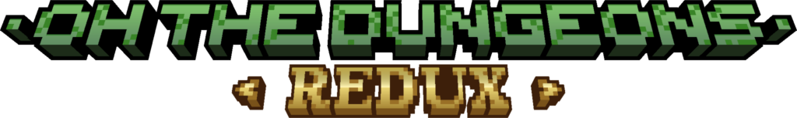
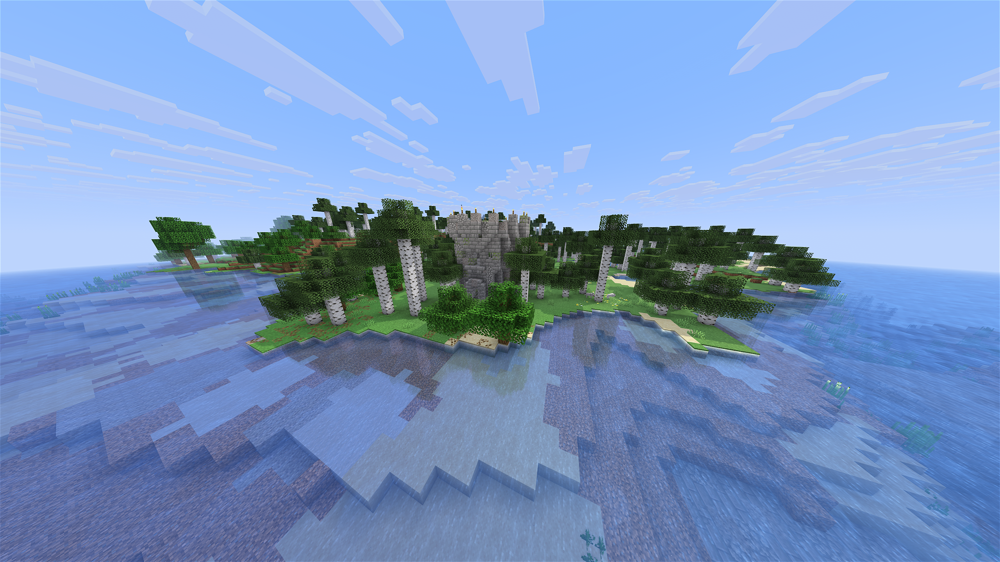
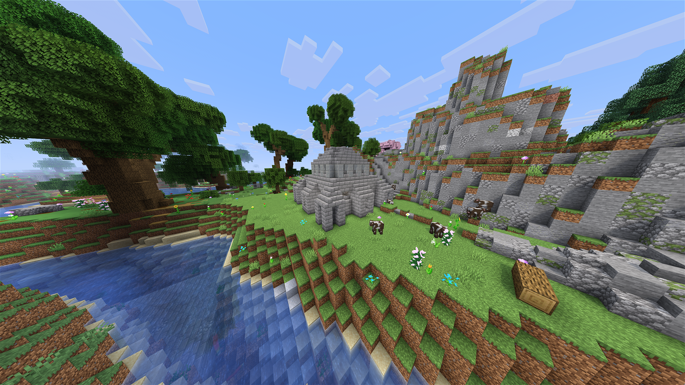
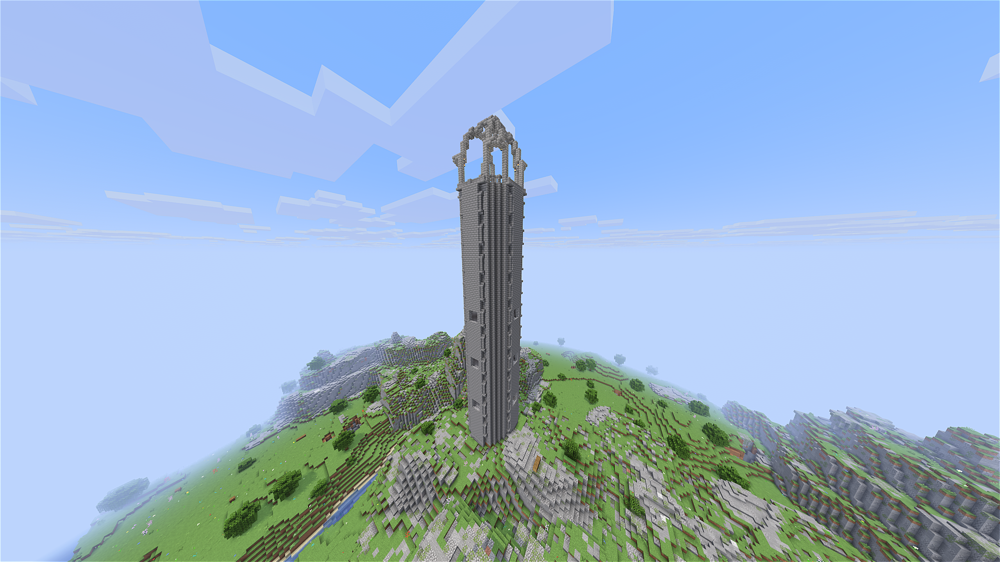
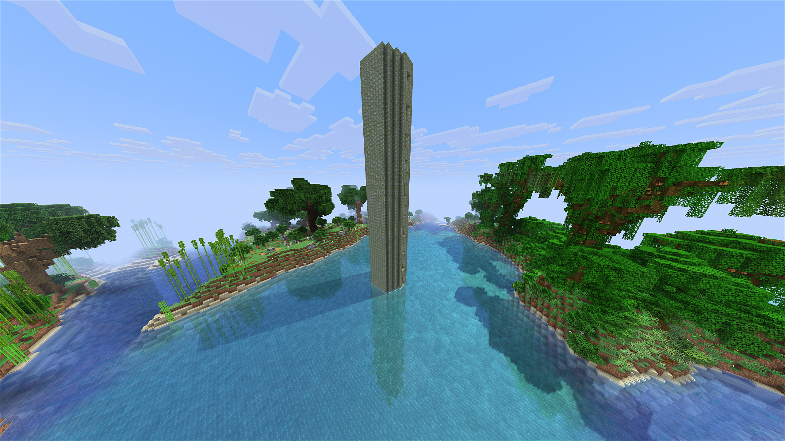
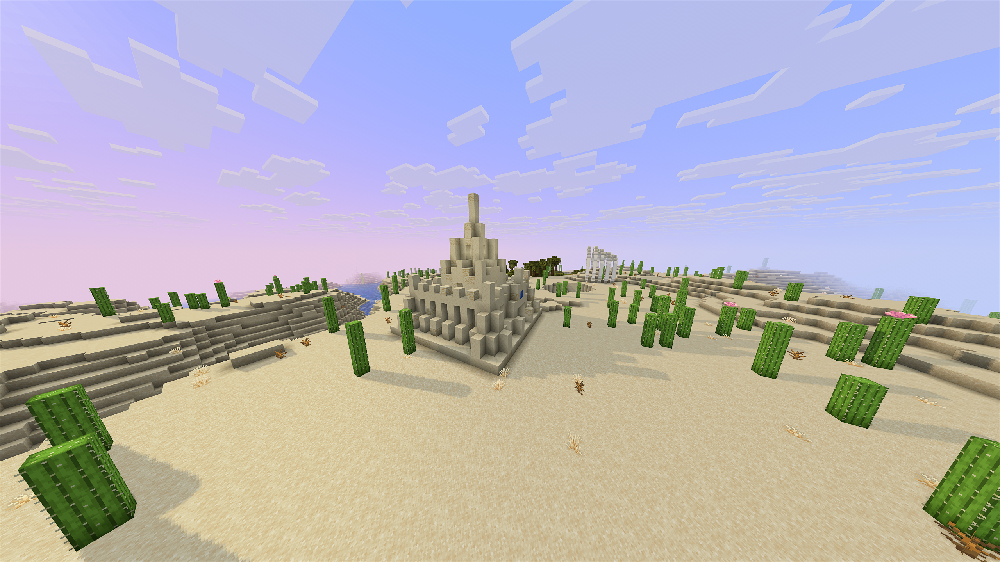

  

---

<h3 align="center">

</h3>

---
 

  

> [!WARNING]
> I try my best to extensively test each release of this plugin. But due to my limited time, some bugs might still occur. OTD-R is tested on both **Paper** and **Leaf** server software and works fine there.

### What is this plugin?

This plugin is a fork of Oh The Dungeons You'll Go, which was a minecraft plugin that added various, procedurally generated dungeons to the game. It was abandoned by its original creator in late 2021, and this is a fork which aims to update it and make it more user friendly.

It has **70** dungeon themes, Custom Loot (with support for plugins like Oraxen or ItemsAdder), "Premade" Bosses, Full GUI & YAML Config Support and **9** different dungeon types.

### I'm confused... can I get help somewhere?

Yes! Feel free to contact me on [Discord](https://discord.gg/bkZfWZsrF5) or look through the plugin's [Github Wiki](https://github.com/roschreiber/OhTheDungeon-Redux/wiki). 

### How can I suggest features / report bugs?

Open an [issue on Github](https://github.com/roschreiber/OhTheDungeon-Redux/issues). Feel free to also help translating OTD-R on [Crowdin](https://crowdin.com/project/otd-redux)!

  
<h3>Gallery</h3>

   

  
    
<em>a Roguelike Dungeon in a birch forest</em>

    

  
    
<em>a Roguelike Dungeon in a plains forest</em>

    

  
  
<em>a draylar battle tower on a mountain</em>

    

  
  
<em>a battle tower in a sea</em>

    

  
  
<em>a roguelike dungeon in a desert</em>

   

### Servers using OTD-R:

none right now! shoot me a dm / create a PR if you want ur server to be added.

### Big Thanks...

...go out to:

- [shadow_wind](https://www.spigotmc.org/members/shadow_wind.865275/), the original author of OhTheDungeonsYou'llGo, who deleted the plugin some years ago due to lots of criticism
- [steve4744](https://github.com/steve4744/OhTheDungeon), who maintained and kept the plugin alive through multiple MC versions
- Hex_26 & their plugin [TerraformGenerator](https://modrinth.com/plugin/terraformgenerator), which was used for images 2-5 in the gallery above
- tr7zw's [NBT-API](https://github.com/tr7zw/Item-NBT-API) which is used for manipulating spawner NBT
